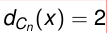
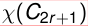
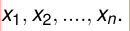
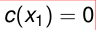
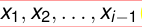
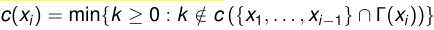

## Grafos

### grafo
es un par ordenado G = (V, E) donde

**V**
es un conjunto cualquiera.

En esta materia siempre supondremos V finito.

**E**
es un subconjunto del conjunto de subconjuntos de 2 elementos de V.

es decir E  $\subseteq$  {A  $\subseteq$  V : |A| = 2}

### Notaciones

#### elementos de V\
se llaman
**vértices**
o nodos. Usaremos preferentemente el primer nombre.

#### elementos de E\
se llaman
**lados**
o aristas. Usaremos preferentemente el primer nombre.

#### cantidad de elementos de V,\
salvo que digamos otra cosa, se denotará por default como n.

#### cantidad de elementos de E,\
salvo que digamos otra cosa, se denotará por default como m.

#### Un elemento {x, y}  $\in$  E\
será abreviado como xy.

x e y se llamarán los extremos del lado xy.

### Subgrafos

Dado un grafo G = (V, E), un
**subgrafo**
de G es un
**grafo**
H = (W, F) tal que W  $\subseteq$  V y F  $\subseteq$  E.

Observemos que pedimos que H sea en si mismo un grafo.
No cualquier par (W, F) con W  $\subseteq$  V y F  $\subseteq$  E será un subgrafo

### Vecinos de un vértice

Dado x  $\in$  V,
los vértices que forman un lado con x se llaman los
**vécinos**
 $\in$  de x.

El conjunto de vécinos se llama el

#### “vecindario”\
y se denota por  $\Gamma$ (x).

Es decir  $\Gamma$ (x) = {y  $\in$  V : xy  $\in$  E}

### Grado de un vértice

La cardinalidad de  $\Gamma$ (x) se llama el
**grado**
de x,
y la denotaremos por d(x) (o dG(x)

#### WARNING:\
en algunos libros se denota usando la letra griega delta:  $\delta$ (x)

###  $\delta$  y ∆

#### El menor de todos los grados\
de un grafo lo denotaremos por  $\delta$ 
y
al

#### mayor de todos los grados\
por ∆.

 $\delta$  = Min{d(x) : x  $\in$  V}
Min{d(x)  $\in$  V} ∆ = Max{d(x) : x  $\in$  V}

Un grafo que tenga  $\delta$  = ∆ (es decir, todos los grados iguales) se llamará un

#### grafo regular.\

o ∆-regular si queremos especificar el grado común a todos los vértices.

### Cíclicos y completos

#### grafo cíclico\
en n vértices, (n > 3) denotado por Cn, es el grafo:

\
{ width=250px }

#### grafo completo\
en n vértices, denotado por Kn, es el grafo:

\
{ width=250px }

Cn y Kn tienen ambos n vértices,
pero Cn tiene n lados mientras que Kn tiene

\
{ width=250px }

lados.

Cn se llaman cíclicos porque su representación gráfica es un ciclo de n puntos.

\
{ width=250px }
\
{ width=250px }

para todo vértice de Cn, mientras que
para todo vértice de Kn.

Por lo tanto ambos son grafos regulares.

 es 2-regular y Kn es (n  $-$  1)-regular).

### camino

\
{ width=250px }
\
{ width=250px }
\
{ width=250px }
\
{ width=250px }

“x  $\sim$  y sii existe un camino entre x e y”

es una relación de equivalencia.

#### Por\
lo tanto el grafo G se parte en clases de equivalencia de esa relación de equivalencia.

Esas partes se llaman las componentes conexas de G.

#### componentes conexas\

### Grafos conexos

Un grafo se dice conexo si tiene una sola componente conexa.

Cn y Kn son conexos.

#### arbol\
es un grafo conexo sin ciclos.

### Determinación de las componentes conexas

El algoritmo básico de DFS o BFS lo que hace es, dado un vértice x, encontrar todos los vértices de la componente conexa de x.

#### algoritmo\

(abajo en vez de BFS puede usarse DFS)

Tomar W = ∅, i = 1.

Tomar un vértice cualquiera x de V.

Correr BFS(x).

LLamarle Ci a la componente conexa que encuentra BFS(x).

Hacer W = W∪ (vértices de Ci).

Si W = V, return C1, C2, ..., Ci.

Si no, hacer i = i + 1, tomar un vértice x $/$  $\in$  W y repetir [3].

## DFS y BFS

#### breve repaso\

a partir de un vértice raiz, los algoritmos van buscando nuevos vértices, buscando vecinos de vértices que ya han sido agregados.
DFS agrega de a un vécino por vez y usa una pila.

BFS agrega todos los vecinos juntos y usa una cola.

### BFS(x):

Crear una cola con x como único elemento.

Tomar C = {x}.
WHILE (la cola no sea vacia)

Tomar p=el primer elemento de la cola.
Borrar p de la cola.
IF existen vértices de  $\Gamma$ (p) que no esten en C:

Agregar todos los elementos de  $\Gamma$ (p) que no estén en C a la cola y a C.

ENDWHILE

return C.

### DFS(x):

Crear una pila con x como único elemento.

Tomar C = {x}.
WHILE (la pila no sea vacia)

Tomar p=el primer elemento de la pila.
IF existe algún vértice de  $\Gamma$ (p) que no esté en C:

Tomar un q  $\in$   $\Gamma$ (p)  $-$  C.
 $\in$   $-$  Hacer C = C ∪ {q}.
∪ {q}. Agregar q a la pila.

ELSE:

Borrar p de la pila.

ENDWHILE

return C.

### Complejidad

la complejidad tanto de DFS como de BFS es O(m).

## Coloreos propios

Un coloreo (de los vértices) es una función cualquiera c : V → S donde S es un conjunto finito.

Un coloreo es propio si xy  $\in$  E ⇒ c(x) $\neq$  c(y) (extremos con distinto color)

Si la cardinalidad de S es k diremos que el coloreo tiene k colores.
En general usaremos S = {0, 1, ..., k  $-$  1} para denotar los colores.

Un grafo que tiene un coloreo propio con k colores se dice k-coloreable.

### número cromático

 $\chi$ (G) = min{k : ∃ un coloreo propio con k colores de G}

### Calculando  $\chi$ (G)

Si uno dice que  $\chi$ (G) = k, por la definición misma de este número, hay que hacer dos cosas para probarlo:

1 Dar un coloreo propio de G con k colores. (y obviamente probar que es propio).

Esto prueba la parte del “∃ un coloreo propio con k colores de G”

2 Probar que no existe ningún coloreo propio con k  $-$  1 colores de G.

Esto prueba que k es el mínimo.

### ayuda útil para probar [2]

Si H es un subgrafo de G, entonces  $\chi$ (H)  $\leq$   $\chi$ (G).

Entonces si encontramos un subgrafo H de G para el cual sepamos que  $\chi$ (H) = k habremos probado [2].

#### prueba por contradicción:\
se asume que existe un coloreo propio con k  $-$  1 colores y deduciendo cosas, se llega a un absurdo.

#### Hay 2 problemas\

1 Llegar al absurdo puede ser bastante dificil, teniendo que contemplar varios casos, pej.

2 Para poder hacer la prueba por contradicción, hay que asumir que existe un coloreo propio con k  $-$  1 colores.

 $-$  Eso significa que uds. NO TIENEN CONTROL sobre ese coloreo.
Sólo saben que hay uno, y deben deducir cosas sobre ese coloreo a partir de la estructura del grafo.

###  $\chi$ (G) para algunos grafos

En general, dado que para cualquier grafo G podemos darle un color distinto a todos los vértices, tenemos la desigualdad  $\chi$ (G)  $\leq$  n.
 $\chi$ (Kn) = n
si quieren probar que r  $\leq$   $\chi$ (G) basta con ver que existe un Kr subgrafo de G.
 $\chi$ (G) = 1 si y solo si E = ∅ asi que para cualquier grafo que tenga al menos un lado,  $\chi$ (G) ∅  $\geq$  2.

\
{ width=250px }

pues podemos colorear c(i) = (i mod 2)

\
{ width=250px }

con
tendriamos que 2r + 1 y 1 tendrían color 1, absurdo pues forman lado.
Podemos colorear: c(i) = (i mod 2) si i < 2r + 1 y c(2r + 1) = 2.

los ciclos impares
tienen número cromático igual a 3.

cualquier grafo que tenga como subgrafo a un ciclo impar debe tener número cromático mayor o igual que 3.

### Algoritmo de fuerza bruta

simplemente tomar todos los coloreos posibles con los colores {0, 1, ..., n  $-$  1} y calcular cuales {0,  $-$  1} de esos coloreo son propios, y ver de entre esos quien tiene la menor cantidad de colores.

#### Este algoritmo calcula  $\chi$ (G) pero:\

Hay nn posibles coloreos.
Chequear que un coloreo es propio es O(m).

el algoritmo tiene complejidad O(nnm) asi que no es útil salvo para n muy chicos.

### Algoritmo Greedy

El algoritmo Greedy requiere como input no sólo un grafo G sino un
**orden**
de los vértices.

para extraer el mayor beneficio posible de Greedy conviene poder llamarlo varias veces cambiando el orden.

#### Idea de Greedy\

La idea de Greedy consiste de dos partes:

1 Ir coloreando los vértices de G uno por uno, en el orden dado, manteniendo siempre el invariante que el coloreo parcial que se va obteniendo es propio.

2 Darle a cada vértice al momento de colorearlo el menor color posible que se le pueda dar manteniendo el invariante de que el coloreo es propio.

#### Greedy\

Input: Grafo G y orden de los vértices

\
{ width=250px }
\
{ width=250px }

Para i > 1, asumiendo que los vértices

\
{ width=250px }

ya han sido coloreados, colorear xi con:

\
{ width=250px }

estamos usando la notación usual de c(A) = {c(a) : a  $\in$  A}.

Es decir, xi recibe el menor color que sea distinto del color de todos los vecinos anteriores a xi.

#### Complejidad de Greedy\

la complejidad de Greedy es

\
{ width=250px }

Por el lema del apretón de manos que vieron en Discreta I, la suma de todos los grados es igual a 2m.

Por lo tanto
la complejidad de Greedy es O(2m) = O(m), polinomial.