# Flujos Y Networks.

## Grafos Dirigidos

### Definición:
Un Grafo dirigido es un par G = (V, E) donde V es un conjunto cualquiera (finito para nosotros) y E  $\subseteq$  V  $\times$  V

#### diferencia con un grafo no dirigido\
E  $\subseteq$  V  $\times$  V

ahora los lados son pares ordenados en vez de conjuntos.

no es lo mismo (x, y) que (y, x)

### Notación:

\
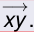{ width=250px }

Denotaremos el lado (x, y) como

### Vecinos

Pero ahora como podemos tener lados tanto (x, y) como (y, x) deberiamos diferenciar entre “vécinos hacia adelante” y “vécinos hacia atras”

#### Notación:\

\
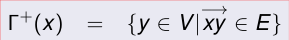{ width=250px }
\
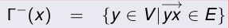{ width=250px }

## Network

### Definición:
Un Network es un grafo dirigido con pesos positivos en los lados, es decir, un triple (V, E, c) donde (V, E) es un grafo dirigido y

\
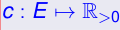{ width=250px }
\
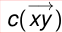{ width=250px }

En este contexto,
se llamará la

### “capacidad”
del lado

\
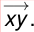{ width=250px }

## Flujos

### Notación para agilizar lecturas de sumatorias

#### P\
Si P es una propiedad que puede ser verdadera o falsa, [P] denota el número 1 si P es verdadera, y 0 si P es falsa.

Supongamos que tenemos una variable x, y queremos sumar una función f(x) sobre todos los x que satisfagan una propiedad P(x)

podemos simplemente escribir 
 x f(x)[P(x)]

\
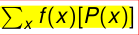{ width=250px }

 o incluso

\
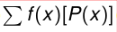{ width=250px }

si queda claro que sumamos sobre x.

### Notación para funciones sobre lados

Si g es una función definida en los lados y A y B son subconjuntos de vertices, entonces g(A, B) denotará la suma:

\
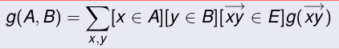{ width=250px }

### in y out

Dada una función g sobre lados y un vértice x, definimos:

 outg(x) es todo lo que “sale” de x por medio de g.

 ing(x) es todo lo que “entra” a x por medio de g.

\
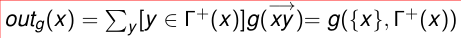{ width=250px }
\
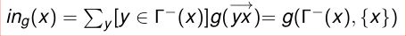{ width=250px }

### Definición
Dado un network (V, E, c), y un par de vertices s, t  $\in$  V, un  $\in$  flujo de s a t es una función f : E → R con las siguientes

### propiedades:

\
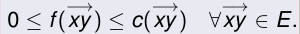{ width=250px }

(“feasability”)

 inf(x) = outf(x)  $\forall$ x  $\in$  V  $-$  {s, t}. (“conservación”)

\
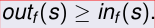{ width=250px }

(s es productor)

(t es consumidor)

\
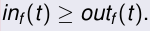{ width=250px }

#### Explicación\

la primera propiedad dice que no vamos a transportar una cantidad negativa de un bien

ni vamos a tranportar por encima de la capacidad de transporte de un lado.

La segunda propiedad dice que el network no tiene “pérdidas” .

La tercera especifica que s es un vértice donde hay una producción neta de bienes, pues produce mas de lo que consume.

y la cuarta que t es un vértice donde se consumen los bienes pues consume mas de lo que produce.

En algunos libros en vez de 3) se pide directamente

\
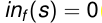{ width=250px }

y en vez de 4) se pide

\
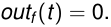{ width=250px }

en todos los ejemplos que usaremos,

\
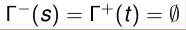{ width=250px }

s se llama tradicionalmente la “fuente”(source)

y t el “resumidero”(sink).

### Valor de un flujo

#### Definición\
Dado un network (V, E, c) el
**valor**
de un flujo f de s a t es:

\
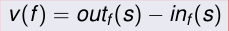{ width=250px }

el valor de un flujo es la cantidad neta de bienes producidos.

### Flujos maximales

#### Definición\
Dado un network N y vertices s, t,
**un flujo maximal de s a t**
(o “Max flow”)
es un flujo f de s a t tal que v(g)  $\leq$  v(f) para todo flujo g de s a t.

#### Propiedad\

Propiedades 1,2 y 3 implican la 4), y v(f) = inf(t)  $-$  outf(t).