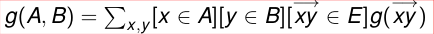
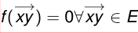
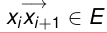

# Flujos: Greedy.

## notación g(A, B)

g es una función sobre los lados y A, B  $\subseteq$  V

\
{ width=250px }

g(A, B) = � x,y[x  $\in$  A][y  $\in$  B][  $-$ → xy  $\in$  E]g(  $-$ → xy )

### Propiedad:

Sean f, g funciones sobre los lados tales que

g(  $-$ → xy )  $\leq$  f(  $-$ → xy )  $\forall$   $-$ → xy  $\in$  E

\
{ width=250px }

Entonces

g(A, B)  $\leq$  f(A, B)  $\forall$ A, B  $\subseteq$  V

## Criterio simple para maximalidad

### Propiedad:

Sea f flujo en un network N tal que v(f) = c({s}, V). Entonces f es maximal.

## Existencia

de la definición no es claro que EXISTA un flujo maximal.

### flujo sea “entero”,
es decir que las capacidades y el flujo en cada lado deben ser números enteros,

### entonces,
como hay una cantidad finita de flujos enteros, es claro que existe un flujo entero maximal.

## Greedy

### Algoritmo

\
{ width=250px }

Comenzar con f = 0 (es decir, f(  $-$ → xy ) = 0 $\forall$   $-$ → xy  $\in$  E).

Buscar un camino dirigido s = x0, x1, ..., xr = t, con

\
{ width=250px }
\
{ width=250px }

  $-$ → xixi+1  $\in$  E tal que f(  $-$ → xixi+1) < c(  $-$ → xixi+1) para todo
 $\in$  i = 0, ..., r  $-$  1.

(llamaremos a un tal camino un camino dirigido “no saturado” .)

\
{ width=250px }

Calcular  $\epsilon$  = min{c(  $-$ → xixi+1)  $-$  f(xixi+1)}.

Aumentar f a lo largo del camino de 2. en  $\epsilon$ , como se explicó antes.

Repetir 2 hasta que no se puedan hallar mas caminos con esas condiciones.

### Conclusiones sobre Greedy

este Greedy no necesariamente va a encontrar un flujo maximal.

eligiendo inteligentemente los caminos encontramos un flujo maximal.

el Greedy de caminos puede ser modificado para encontrar un flujo maximal en tiempo polinomial

### Not Greedy

En el caso de flujos, se puede construir un algoritmo que corre Greedy y cuando llega a un cierto punto, “SE DA CUENTA” que se equivocó en la elección de los caminos

y CORREGIR los errores.

### Definición de Corte

Un Corte es un subconjunto de los vertices que tiene a s pero no tiene a t.

### Capacidad de un Corte

La capacidad de un corte es cap(S) = c(S, S), donde S = V  $-$  S

### Definición:
Un corte es MINIMAL si su capacidad es la menor de las capacidades de todos los cortes.