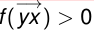
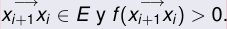
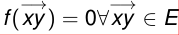
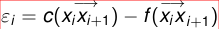
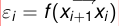
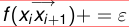
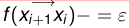

# Ford-Fulkerson

### Complejidad de Greedy

Como en Greedy los lados nunca se des-saturan, entonces Greedy puede hacer a lo sumo O(m) incrementos de flujo antes de que forzosamente deba terminar si o si.

Encontrar un camino dirigido no saturado es O(m)

la complejidad total de Greedy es O(m2).

## FF

### idea

\
{ width=250px }

en vez de limitar la busqueda a y  $\in$   $\Gamma$ +(x) con f(  $-$ → xy ) < c(  $-$ → xy )

\
{ width=250px }

permiten ademas buscar y  $\in$   $\Gamma$  $-$ (x) con f(  $-$ → yx ) > 0

\
{ width=250px }
\
{ width=250px }

### Camino aumentante

Un camino aumentante (o f-camino aumentante si necesitamos especificar f) o camino de Ford-Fulkerson, es una sucesión de vértices x0, x1, ...., xr tales que:

x0 = s, xr = t.
Para cada i = 0, ..., r  $-$  1 ocurre una de las dos cosas siguientes:

\
{ width=250px }

1  $-$ → xixi+1  $\in$  E y f(  $-$ → xixi+1) < c(  $-$ → xixi+1)

\
{ width=250px }

2  $-$ → xi+1xi  $\in$  E y f(  $-$ → xi+1xi) > 0.

Si en vez de comenzar en s y terminar t el camino es como arriba pero con x0 = x,xr = z diremos que es un camino aumentante
**desde x a z**

#### Lados forward y backward\

A los lados en 1) los llamaremos “lados de tipo I” o
**“lados forward”**

A los lados en 2) los llamaremos “lados de tipo II” o
**“lados backward”**

### Algoritmo de Ford-Fulkerson

\
{ width=250px }

Comenzar con f = 0 (es decir, f(  $-$ → xy ) = 0 $\forall$   $-$ → xy  $\in$  E).

Buscar un f-camino aumentante s = x0, x1, ..., xr = t.

Definir  $\epsilon$ i de la siguiente manera:

\
{ width=250px }

 $\epsilon$ i = c(  $-$ → xixi+1)  $-$  f(  $-$ → xixi+1) en los lados forward.

\
{ width=250px }

 $\epsilon$ i = f(  $-$ → xi+1xi) en los lados backward.

Calcular  $\epsilon$  = min{ $\epsilon$ i}.

Cambiar f a lo largo del camino de [2] en  $\epsilon$ , de la siguiente forma:

\
{ width=250px }

f(  $-$ → xixi+1)+ =  $\epsilon$  en los lados forward.

\
{ width=250px }

f(  $-$ → xi+1xi) $-$  =  $\epsilon$  en los lados backwards.

Repetir [2] hasta que no se puedan hallar mas caminos aumentantes.

### FordFulkerson mantiene “flujicidad”

Si f es un flujo de valor v y aumentamos f con un f-camino aumentante con  $\epsilon$  calculado como se explica en el algoritmo de Ford-Fulkerson, entonces lo que queda sigue siendo flujo y el valor del nuevo flujo es v +  $\epsilon$ 

### Complejidad de Ford-Fulkerson

NO ES polinomial:

## Max Flow Min Cut

### Teorema

\
{ width=250px }

#### A\
Si f es un flujo y S es un corte, entonces v(f) = f(S, S)  $-$  f(S, S).

#### B\
El valor de todo flujo es menor o igual que la capacidad de todo corte.

#### C\
Si f es un flujo, las siguientes afirmaciones son equivalentes:

1 Existe un corte S tal que v(f) = cap(S).
2 f es maximal.
3 No existen f-caminos aumentantes.

### Corolario

Si el algoritmo de Ford-Fulkerson termina, termina con un flujo maximal

## Teorema de la Integralidad

### Teorema de la integralidad.

En un network con capacidades enteras, todo flujo entero maximal es un flujo maximal.

### Teorema
En un network donde todas las capacidades sean enteros, Ford-Fulkerson siempre termina y el flujo maximal resultante es un flujo entero.