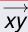
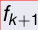
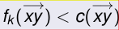
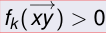
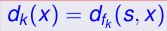
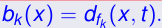
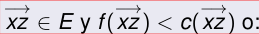
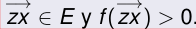
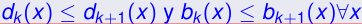

## Complejidad de Edmonds-Karp

### Teorema de Edmonds-Karp

La complejidad del algoritmo de Edmonds-Karp es O(nm2)

### Lados críticos

#### Definición
\

\
{ width=250px }

Diremos que un llado
**se vuelve crítico**
durante la construcción de uno de los flujos intermedios (digamos, fk+1) si para la construcción de

\
{ width=250px }

pasa una de las dos cosas siguientes:

1 Se usa el lado en forma forward, saturandolo (es decir

\
{ width=250px }
\
{ width=250px }

pero luego

2 O se usa el lado en forma backward, vaciandolo (es decir

\
{ width=250px }
\
{ width=250px }

pero

### distancias

#### Definición
\
Dados vértices x, z y flujo f definimos a
**la distancia entre x y z relativa a f**
como la longitud del menor f-camino aumentante entre x y z, si es que existe tal camino, o infinito si no existe o 0 si x = z.
**La denotaremos como df(x, z).**

#### Notación
\
Dado un vértice x denotamos

\
{ width=250px }

y

\
{ width=250px }

#### Es decir,
\
 dk(x) es la longitud del menor fk-camino aumentante entre s y x y bk(x) es la longitud del menor fk-camino aumentante entre x y t.

### Definición
Dado un flujo f y un vértice x, diremos que un vértice z es un vécino fFF de x si pasa alguna de las siguientes condiciones:

\
{ width=250px }
\
{ width=250px }

### Observación trivial:
Si z es un fkFF vécino de x, entonces dk(z)  $\leq$  dk(x) + 1

### Lema de las distancias
Las distancias definidas anteriormente no disminuyen a medida que k crece.

\
{ width=250px }

Es decir,

## Existencia de flujos maximales

Dado que hemos probado que Edmonds-Karp siempre termina, y dado que produce un flujo maximal,

entonces tambien hemos probado que
en todo network siempre existe al menos un flujo maximal.