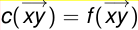
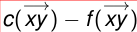
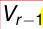

# El algoritmo de Dinitz

## idea básica de Dinitz
“guardar” todos los posibles caminos aumentantes de la misma longitud (mínima) en una estructura auxiliar.

esta primera parte se hace, al igual que con Edmonds-Karp, con BFS, pero guardamos toda la información y no sólo la necesaria para construir un camino.

## Esquema básico de Dinitz

1 Construir un network auxiliar (usando BFS).
2 Correr Greedy con DFS en el network auxiliar hasta no poder seguir.

3 Usar el flujo obtenido en el network auxiliar para modificar el flujo en el network original.

4 Repetir [1] con el nuevo flujo, hasta que, al querer construir un network auxiliar, no llegamos a t.

En el network auxiliar, como se usa Greedy, nunca se des-satura un lado.
los lados siguen pudiendo des-saturarse, es sólo en el network auxiliar que no se des-saturan.

### Flujos bloqueantes

#### Definición:\
Llamaremos a un flujo en un network
si todo camino DIRIGIDO desde s a t tiene al menos un lado

\
{ width=250px }

saturado. (es decir con c(  $-$ → xy ) = f(  $-$ → xy )).

En otras palabras, si cuando queremos usar Greedy en el network, no llegamos a t.

## Algoritmos tipo Dinic

1 Construir un network auxiliar (usando BFS).

2 Encontrar un flujo bloqueante en el network auxiliar.
3 Usar ese flujo bloqueante del network auxiliar para modificar el flujo en el network original.

4 Repetir [1] con el nuevo flujo, hasta que, al querer construir un network auxiliar, no llegamos a t.

## Layered Networks

### network “por niveles”.

#### Definición:\
Un Network por niveles es un network tal que el conjunto de vértices esta dividido en subconjuntos Vi (los “niveles”) tales que sólo existen lados entre un nivel y el siguiente.

\
{ width=250px }

Es decir,  $-$ → xy  $\in$  E  $\Rightarrow$   $\exists$ i : x  $\in$  Vi, y  $\in$  Vi+1

## Network auxiliar,

### vértices

\
{ width=250px }

el conjunto de vértices es V =  $\cup$ r i=0Vi, donde los Vi son:

Sea r = df(s, t) donde df es la función definida en la prueba de Edmonds-Karp.

Es decir, r es la distancia entre s y t usando caminos aumentantes.

Para i = 0, 1, ..., r  $-$  1, definimos Vi = {x : df(s, x) = i}.

Observar que entonces V0 = {s}.

Definimos Vr = {t}

### Lados y capacidades:
 $-$ → xy es un lado del network auxiliar si:

x  $\in$  Vi, y  $\in$  Vi+1
y:

\
{ width=250px }
\
{ width=250px }

1  $-$ → xy es un lado del network original con f(  $-$ → xy ) < c(  $-$ → xy ).
o:

\
{ width=250px }
\
{ width=250px }

2  $-$ → yx es un lado del network original con f(  $-$ → yx ) > 0.

\
{ width=250px }

En el caso de [1], la capacidad de  $-$ → xy en el network

\
{ width=250px }

auxiliar será c(  $-$ → xy )  $-$  f(  $-$ → xy ), y en el caso de [2], la

\
{ width=250px }
\
{ width=250px }

capacidad del lado  $-$ → xy en el network auxiliar será f(  $-$ → yx ).

### Otra forma de pensar esto
es que construimos primero un “network residual”

#### Cuyos lados son:\

los lados originales, con capacidad igual a c  $-$  f
 $-$  Y los reversos de los lados originales, con capacidad f.

Y luego, de ese network residual nos quedamos con los lados que unan vertices de distancia i con vértices de distancia i + 1.

### Construcción

la forma de construirla es tomar como V0 a {s}.

Y luego ir construyendo una cola a partir de s al estilo Edmonds-Karp.

Y si x agrega a z y x está en Vi, entonces z está en Vi+1.

\
{ width=250px }

si z ya está agregado, si bien z no se  $-$ → xz vuelve a agregar, el lado  $-$ → xz si se agrega al network auxilir, siempre y cuando la distancia de z a s sea uno mas que la distancia de x a s.

Si en algún momento llegamos a t, no paramos inmediatamente, pues podria haber mas lados que lleguen a t.

Pero borramos todos los vértices que ya hubieramos incluido en el mismo Vr en el cual estamos poniendo a t

Y de ahi en mas no agregamos mas vértices, sólo lados entre vértices de Vr $-$ 1 y t.

\
{ width=250px }

### Observaciones

Como el network auxiliar es un network por niveles,
**todos**
los caminos de un mismo network auxiliar deben tener
**la misma longitud.**

Si obtienen dos caminos de distinta longitud dentro de un mismo NA, lo tienen mal.