# Grafos
<!-- from 01_Grafos_shortened_HIGHEXT.md -->

### grafo
<!-- from 01_Grafos_shortened_HIGHEXT.md -->
es un par ordenado G = (V, E) donde

**V**
es un conjunto cualquiera.

En esta materia siempre supondremos V finito.

**E**
es un subconjunto del conjunto de subconjuntos de 2 elementos de V.

es decir E  $\subseteq$  {A  $\subseteq$  V : |A| = 2}

### Notaciones
<!-- from 01_Grafos_shortened_HIGHEXT.md -->

#### elementos de V
<!-- from 01_Grafos_shortened_HIGHEXT.md -->
\
se llaman
**vértices**
o nodos. Usaremos preferentemente el primer nombre.

#### elementos de E
<!-- from 01_Grafos_shortened_HIGHEXT.md -->
\
se llaman
**lados**
o aristas. Usaremos preferentemente el primer nombre.

#### cantidad de elementos de V,
<!-- from 01_Grafos_shortened_HIGHEXT.md -->
\
salvo que digamos otra cosa, se denotará por default como n.

#### cantidad de elementos de E,
<!-- from 01_Grafos_shortened_HIGHEXT.md -->
\
salvo que digamos otra cosa, se denotará por default como m.

#### Un elemento {x, y}  $\in$  E
<!-- from 01_Grafos_shortened_HIGHEXT.md -->
\
será abreviado como xy.

x e y se llamarán los extremos del lado xy.

### Subgrafos
<!-- from 01_Grafos_shortened_HIGHEXT.md -->

Dado un grafo G = (V, E), un
**subgrafo**
de G es un
**grafo**
H = (W, F) tal que W  $\subseteq$  V y F  $\subseteq$  E.

Observemos que pedimos que H sea en si mismo un grafo.
No cualquier par (W, F) con W  $\subseteq$  V y F  $\subseteq$  E será un subgrafo

### Vecinos de un vértice
<!-- from 01_Grafos_shortened_HIGHEXT.md -->

Dado x  $\in$  V,
los vértices que forman un lado con x se llaman los
**vécinos**
$\in$  de x.

El conjunto de vécinos se llama el

#### “vecindario”
<!-- from 01_Grafos_shortened_HIGHEXT.md -->
\
y se denota por  $\Gamma$ (x).

Es decir  $\Gamma$ (x) = {y  $\in$  V : xy  $\in$  E}

### Grado de un vértice
<!-- from 01_Grafos_shortened_HIGHEXT.md -->

La cardinalidad de  $\Gamma$ (x) se llama el
**grado**
de x,
y la denotaremos por d(x) (o dG(x)

#### WARNING:
<!-- from 01_Grafos_shortened_HIGHEXT.md -->
\
en algunos libros se denota usando la letra griega delta:  $\delta$ (x)

###  $\delta$  y  $\Delta$
<!-- from 01_Grafos_shortened_HIGHEXT.md -->

#### El menor de todos los grados
<!-- from 01_Grafos_shortened_HIGHEXT.md -->
\
de un grafo lo denotaremos por  $\delta$
y
al

#### mayor de todos los grados
<!-- from 01_Grafos_shortened_HIGHEXT.md -->
\
por  $\Delta$ .

$\delta$  = Min{d(x) : x  $\in$  V}
Min{d(x)  $\in$  V}  $\Delta$  = Max{d(x) : x  $\in$  V}

Un grafo que tenga  $\delta$  =  $\Delta$  (es decir, todos los grados iguales) se llamará un

#### grafo regular.
<!-- from 01_Grafos_shortened_HIGHEXT.md -->
\

o  $\Delta$ -regular si queremos especificar el grado común a todos los vértices.

### Cíclicos y completos
<!-- from 01_Grafos_shortened_HIGHEXT.md -->

#### grafo cíclico
<!-- from 01_Grafos_shortened_HIGHEXT.md -->
\
en n vértices, (n > 3) denotado por Cn, es el grafo:

\
{ width=250px }

#### grafo completo
<!-- from 01_Grafos_shortened_HIGHEXT.md -->
\
en n vértices, denotado por Kn, es el grafo:

\
{ width=250px }

Cn y Kn tienen ambos n vértices,
pero Cn tiene n lados mientras que Kn tiene

\
{ width=250px }

lados.

Cn se llaman cíclicos porque su representación gráfica es un ciclo de n puntos.

\
{ width=250px }
\
{ width=250px }

para todo vértice de Cn, mientras que
para todo vértice de Kn.

Por lo tanto ambos son grafos regulares.

es 2-regular y Kn es (n  $-$  1)-regular).

### camino
<!-- from 01_Grafos_shortened_HIGHEXT.md -->

\
{ width=250px }
\
{ width=250px }
\
{ width=250px }
\
{ width=250px }

“x  $\sim$  y sii existe un camino entre x e y”

es una relación de equivalencia.

#### Por
<!-- from 01_Grafos_shortened_HIGHEXT.md -->
\
lo tanto el grafo G se parte en clases de equivalencia de esa relación de equivalencia.

Esas partes se llaman las componentes conexas de G.

#### componentes conexas
<!-- from 01_Grafos_shortened_HIGHEXT.md -->
\

### Grafos conexos
<!-- from 01_Grafos_shortened_HIGHEXT.md -->

Un grafo se dice conexo si tiene una sola componente conexa.

Cn y Kn son conexos.

#### arbol
<!-- from 01_Grafos_shortened_HIGHEXT.md -->
\
es un grafo conexo sin ciclos.

### Determinación de las componentes conexas
<!-- from 01_Grafos_shortened_HIGHEXT.md -->

El algoritmo básico de DFS o BFS lo que hace es, dado un vértice x, encontrar todos los vértices de la componente conexa de x.

#### algoritmo
<!-- from 01_Grafos_shortened_HIGHEXT.md -->
\

(abajo en vez de BFS puede usarse DFS)

Tomar W =  $\varnothing$ , i = 1.

Tomar un vértice cualquiera x de V.

Correr BFS(x).

LLamarle Ci a la componente conexa que encuentra BFS(x).

Hacer W = W $\cup$  (vértices de Ci).

Si W = V, return C1, C2, ..., Ci.

Si no, hacer i = i + 1, tomar un vértice x $/$  $\in$  W y repetir [3].

## DFS y BFS
<!-- from 01_Grafos_shortened_HIGHEXT.md -->

#### breve repaso
<!-- from 01_Grafos_shortened_HIGHEXT.md -->
\

a partir de un vértice raiz, los algoritmos van buscando nuevos vértices, buscando vecinos de vértices que ya han sido agregados.
DFS agrega de a un vécino por vez y usa una pila.

BFS agrega todos los vecinos juntos y usa una cola.

### BFS(x):
<!-- from 01_Grafos_shortened_HIGHEXT.md -->

Crear una cola con x como único elemento.

Tomar C = {x}.
WHILE (la cola no sea vacia)

Tomar p=el primer elemento de la cola.
Borrar p de la cola.
IF existen vértices de  $\Gamma$ (p) que no esten en C:

Agregar todos los elementos de  $\Gamma$ (p) que no estén en C a la cola y a C.

ENDWHILE

return C.

### DFS(x):
<!-- from 01_Grafos_shortened_HIGHEXT.md -->

Crear una pila con x como único elemento.

Tomar C = {x}.
WHILE (la pila no sea vacia)

Tomar p=el primer elemento de la pila.
IF existe algún vértice de  $\Gamma$ (p) que no esté en C:

Tomar un q  $\in$   $\Gamma$ (p)  $-$  C.
$\in$   $-$  Hacer C = C  $\cup$  {q}.
$\cup$  {q}. Agregar q a la pila.

ELSE:

Borrar p de la pila.

ENDWHILE

return C.

### Complejidad
<!-- from 01_Grafos_shortened_HIGHEXT.md -->

la complejidad tanto de DFS como de BFS es O(m).

## Coloreos propios
<!-- from 01_Grafos_shortened_HIGHEXT.md -->

Un coloreo (de los vértices) es una función cualquiera c : V → S donde S es un conjunto finito.

Un coloreo es propio si xy  $\in$  E  $\Rightarrow$  c(x) $\neq$  c(y) (extremos con distinto color)

Si la cardinalidad de S es k diremos que el coloreo tiene k colores.
En general usaremos S = {0, 1, ..., k  $-$  1} para denotar los colores.

Un grafo que tiene un coloreo propio con k colores se dice k-coloreable.

### número cromático
<!-- from 01_Grafos_shortened_HIGHEXT.md -->

$\chi$ (G) = min{k :  $\exists$  un coloreo propio con k colores de G}

### Calculando  $\chi$ (G)
<!-- from 01_Grafos_shortened_HIGHEXT.md -->

Si uno dice que  $\chi$ (G) = k, por la definición misma de este número, hay que hacer dos cosas para probarlo:

1 Dar un coloreo propio de G con k colores. (y obviamente probar que es propio).

Esto prueba la parte del “ $\exists$  un coloreo propio con k colores de G”

2 Probar que no existe ningún coloreo propio con k  $-$  1 colores de G.

Esto prueba que k es el mínimo.

### ayuda útil para probar [2]
<!-- from 01_Grafos_shortened_HIGHEXT.md -->

Si H es un subgrafo de G, entonces  $\chi$ (H)  $\leq$   $\chi$ (G).

Entonces si encontramos un subgrafo H de G para el cual sepamos que  $\chi$ (H) = k habremos probado [2].

#### prueba por contradicción:
<!-- from 01_Grafos_shortened_HIGHEXT.md -->
\
se asume que existe un coloreo propio con k  $-$  1 colores y deduciendo cosas, se llega a un absurdo.

#### Hay 2 problemas
<!-- from 01_Grafos_shortened_HIGHEXT.md -->
\

1 Llegar al absurdo puede ser bastante dificil, teniendo que contemplar varios casos, pej.

2 Para poder hacer la prueba por contradicción, hay que asumir que existe un coloreo propio con k  $-$  1 colores.

$-$  Eso significa que uds. NO TIENEN CONTROL sobre ese coloreo.
Sólo saben que hay uno, y deben deducir cosas sobre ese coloreo a partir de la estructura del grafo.

###  $\chi$ (G) para algunos grafos
<!-- from 01_Grafos_shortened_HIGHEXT.md -->

En general, dado que para cualquier grafo G podemos darle un color distinto a todos los vértices, tenemos la desigualdad  $\chi$ (G)  $\leq$  n.
$\chi$ (Kn) = n
si quieren probar que r  $\leq$   $\chi$ (G) basta con ver que existe un Kr subgrafo de G.
$\chi$ (G) = 1 si y solo si E =  $\varnothing$  asi que para cualquier grafo que tenga al menos un lado,  $\chi$ (G)  $\varnothing$   $\geq$  2.

\
{ width=250px }

pues podemos colorear c(i) = (i mod 2)

\
{ width=250px }

con
tendriamos que 2r + 1 y 1 tendrían color 1, absurdo pues forman lado.
Podemos colorear: c(i) = (i mod 2) si i < 2r + 1 y c(2r + 1) = 2.

los ciclos impares
tienen número cromático igual a 3.

cualquier grafo que tenga como subgrafo a un ciclo impar debe tener número cromático mayor o igual que 3.

### Algoritmo de fuerza bruta
<!-- from 01_Grafos_shortened_HIGHEXT.md -->

simplemente tomar todos los coloreos posibles con los colores {0, 1, ..., n  $-$  1} y calcular cuales {0,  $-$  1} de esos coloreo son propios, y ver de entre esos quien tiene la menor cantidad de colores.

#### Este algoritmo calcula  $\chi$ (G) pero:
<!-- from 01_Grafos_shortened_HIGHEXT.md -->
\

Hay nn posibles coloreos.
Chequear que un coloreo es propio es O(m).

el algoritmo tiene complejidad O(nnm) asi que no es útil salvo para n muy chicos.

### Algoritmo Greedy
<!-- from 01_Grafos_shortened_HIGHEXT.md -->

El algoritmo Greedy requiere como input no sólo un grafo G sino un
**orden**
de los vértices.

para extraer el mayor beneficio posible de Greedy conviene poder llamarlo varias veces cambiando el orden.

#### Idea de Greedy
<!-- from 01_Grafos_shortened_HIGHEXT.md -->
\

La idea de Greedy consiste de dos partes:

1 Ir coloreando los vértices de G uno por uno, en el orden dado, manteniendo siempre el invariante que el coloreo parcial que se va obteniendo es propio.

2 Darle a cada vértice al momento de colorearlo el menor color posible que se le pueda dar manteniendo el invariante de que el coloreo es propio.

#### Greedy
<!-- from 01_Grafos_shortened_HIGHEXT.md -->
\

Input: Grafo G y orden de los vértices

\
{ width=250px }
\
{ width=250px }

Para i > 1, asumiendo que los vértices

\
{ width=250px }

ya han sido coloreados, colorear xi con:

\
{ width=250px }

estamos usando la notación usual de c(A) = {c(a) : a  $\in$  A}.

Es decir, xi recibe el menor color que sea distinto del color de todos los vecinos anteriores a xi.

#### Complejidad de Greedy
<!-- from 01_Grafos_shortened_HIGHEXT.md -->
\

la complejidad de Greedy es

\
{ width=250px }

Por el lema del apretón de manos que vieron en Discreta I, la suma de todos los grados es igual a 2m.

Por lo tanto
## Cotas para Greedy
<!-- from 02_Clase2Greedyreorden2COLORB_v2_HIGHEXT.md -->

$\chi$ (G)  $\leq$   $\Delta$  + 1

## Teorema de Brooks
<!-- from 02_Clase2Greedyreorden2COLORB_v2_HIGHEXT.md -->

Si G es conexo, entonces  $\chi$ (G)  $\leq$   $\Delta$ , a menos que G sea un ciclo impar o un grafo completo.

### Propiedad
<!-- from 02_Clase2Greedyreorden2COLORB_v2_HIGHEXT.md -->

Si G es conexo, entonces existe un ordenamiento de los vértices tal que Greeedy colorea todos los vértices, salvo uno, con  $\Delta$  colores o menos.

## VIT
<!-- from 02_Clase2Greedyreorden2COLORB_v2_HIGHEXT.md -->

### Very Important Theorem
<!-- from 02_Clase2Greedyreorden2COLORB_v2_HIGHEXT.md -->

Sea G = (V, E) un grafo cuyos vértices estan coloreados con un coloreo propio c con r colores {0, 1, ..., r  $-$  1}.
{0,  $-$  1}. Sea  $\pi$  una permutación de los números 0, 1, ..., r  $-$  1, es decir,  $-$   $\pi$  : {0, 1, ..., r  $-$  1} → {0, 1, ..., r  $-$  1} es una biyección.
{0, Sea Vi =  $-$  1} → {0,  $-$  1} {x  $\in$  V : c(x) = i}, i = 0, 1, ..., r  $-$  1.
{x  $\in$  i},  $-$  Ordenemos los vértices poniendo primero los vértices de V $\pi$ (0), luego los de V $\pi$ (1),etc, hasta V $\pi$ (r $-$ 1).
(el orden interno de los vértices dentro de cada V $\pi$ (i) es irrelevante)

Entonces Greedy en ese orden coloreará G con r colores o menos.

### Corolario
<!-- from 02_Clase2Greedyreorden2COLORB_v2_HIGHEXT.md -->
Existe un ordenamiento de los vértices de G tal que Greedy colorea G con  $\chi$ (G) colores.

### Consecuencia
<!-- from 02_Clase2Greedyreorden2COLORB_v2_HIGHEXT.md -->

si no podemos obtener  $\chi$ (G) polinomialmente, usaremos el VIT para tratar de obtener una aproximación a  $\chi$ (G).

No siempre se puede,
pero en la practica suele funcionar bastante bien, dependiendo de cuales permutaciones  $\pi$  se usen.

## Grafos bipartitos
<!-- from 02_Clase2Greedyreorden2COLORB_v2_HIGHEXT.md -->

Un grafo se dice bipartito si  $\chi$ (G) = 2.

Es decir, si G = (V, E) entonces existen X, Y  $\subseteq$  V tales que:

1 V = X  $\cup$  Y.
$\cup$  2 X  $\cap$  Y =  $\varnothing$

$\cap$   $\varnothing$  3 wv  $\in$  E  $\Rightarrow$  (w  $\in$  X, v  $\in$  Y)  $\lor$  (w  $\in$  Y, v  $\in$  X)

## El problema 2COLOR
<!-- from 02_Clase2Greedyreorden2COLORB_v2_HIGHEXT.md -->

Dado un grafo G, ¿es  $\chi$ (G)  $\leq$  2?

### Teorema
<!-- from 02_Clase2Greedyreorden2COLORB_v2_HIGHEXT.md -->

2COLOR es polinomial

## Algoritmo 2COLOR para G conexo.
<!-- from 02_Clase2Greedyreorden2COLORB_v2_HIGHEXT.md -->

Elegir un vértice x cualquiera.

Correr BFS(x), creando un arbol.

Para cada vértice z, sea N(z) el nivel de z en el arbol BFS(x).

Colorear c(z) = (N(z) mod 2).

Chequear si el colorario dado en [4] es propio.

Si lo es, retornar “ $\chi$ (G)  $\leq$  2”

Si no lo es, retornar “ $\chi$ (G) > 2”

### Complejidad
<!-- from 02_Clase2Greedyreorden2COLORB_v2_HIGHEXT.md -->

la complejidad total es O(m) + O(m) = O(m).

### Corolario
<!-- from 02_Clase2Greedyreorden2COLORB_v2_HIGHEXT.md -->

Sea G un grafo con  $\chi$ (G)  $\geq$  3.

Como  $\chi$ (G)  $\geq$  3, el coloreo de 2 colores dado en el algoritmo no  $\geq$  puede ser propio.

**Conclusión:**

# Flujos Y Networks.
<!-- from 03_flujos2021_v2_HIGHEXT.md -->

## Grafos Dirigidos
<!-- from 03_flujos2021_v2_HIGHEXT.md -->

### Definición:
<!-- from 03_flujos2021_v2_HIGHEXT.md -->
Un Grafo dirigido es un par G = (V, E) donde V es un conjunto cualquiera (finito para nosotros) y E  $\subseteq$  V  $\times$  V

#### diferencia con un grafo no dirigido
<!-- from 03_flujos2021_v2_HIGHEXT.md -->
\
E  $\subseteq$  V  $\times$  V

ahora los lados son pares ordenados en vez de conjuntos.

no es lo mismo (x, y) que (y, x)

### Notación:
<!-- from 03_flujos2021_v2_HIGHEXT.md -->

\
{ width=250px }

Denotaremos el lado (x, y) como

### Vecinos
<!-- from 03_flujos2021_v2_HIGHEXT.md -->

Pero ahora como podemos tener lados tanto (x, y) como (y, x) deberiamos diferenciar entre “vécinos hacia adelante” y “vécinos hacia atras”

#### Notación:
<!-- from 03_flujos2021_v2_HIGHEXT.md -->
\

\
{ width=250px }
\
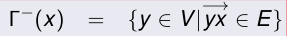{ width=250px }

## Network
<!-- from 03_flujos2021_v2_HIGHEXT.md -->

### Definición:
<!-- from 03_flujos2021_v2_HIGHEXT.md -->
Un Network es un grafo dirigido con pesos positivos en los lados, es decir, un triple (V, E, c) donde (V, E) es un grafo dirigido y

\
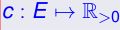{ width=250px }
\
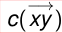{ width=250px }

En este contexto,
se llamará la

### “capacidad”
<!-- from 03_flujos2021_v2_HIGHEXT.md -->
del lado

\
{ width=250px }

## Flujos
<!-- from 03_flujos2021_v2_HIGHEXT.md -->

### Notación para agilizar lecturas de sumatorias
<!-- from 03_flujos2021_v2_HIGHEXT.md -->

#### P
<!-- from 03_flujos2021_v2_HIGHEXT.md -->
\
Si P es una propiedad que puede ser verdadera o falsa, [P] denota el número 1 si P es verdadera, y 0 si P es falsa.

Supongamos que tenemos una variable x, y queremos sumar una función f(x) sobre todos los x que satisfagan una propiedad P(x)

podemos simplemente escribir

\
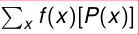{ width=250px }

o incluso

\
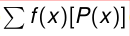{ width=250px }

si queda claro que sumamos sobre x.

### Notación para funciones sobre lados
<!-- from 03_flujos2021_v2_HIGHEXT.md -->

Si g es una función definida en los lados y A y B son subconjuntos de vertices, entonces g(A, B) denotará la suma:

\
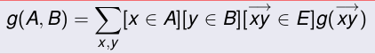{ width=250px }

### in y out
<!-- from 03_flujos2021_v2_HIGHEXT.md -->

Dada una función g sobre lados y un vértice x, definimos:

outg(x) es todo lo que “sale” de x por medio de g.

ing(x) es todo lo que “entra” a x por medio de g.

\
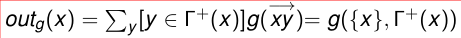{ width=250px }
\
{ width=250px }

### Definición
<!-- from 03_flujos2021_v2_HIGHEXT.md -->
Dado un network (V, E, c), y un par de vertices s, t  $\in$  V, un  $\in$  flujo de s a t es una función f : E → R con las siguientes

### propiedades:
<!-- from 03_flujos2021_v2_HIGHEXT.md -->

\
{ width=250px }

(“feasability”)

inf(x) = outf(x)  $\forall$ x  $\in$  V  $-$  {s, t}. (“conservación”)

\
{ width=250px }

(s es productor)

(t es consumidor)

\
{ width=250px }

#### Explicación
<!-- from 03_flujos2021_v2_HIGHEXT.md -->
\

la primera propiedad dice que no vamos a transportar una cantidad negativa de un bien

ni vamos a tranportar por encima de la capacidad de transporte de un lado.

La segunda propiedad dice que el network no tiene “pérdidas” .

La tercera especifica que s es un vértice donde hay una producción neta de bienes, pues produce mas de lo que consume.

y la cuarta que t es un vértice donde se consumen los bienes pues consume mas de lo que produce.

En algunos libros en vez de 3) se pide directamente

\
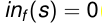{ width=250px }

y en vez de 4) se pide

\
{ width=250px }

en todos los ejemplos que usaremos,

\
{ width=250px }

s se llama tradicionalmente la “fuente”(source)

y t el “resumidero”(sink).

### Valor de un flujo
<!-- from 03_flujos2021_v2_HIGHEXT.md -->

#### Definición
<!-- from 03_flujos2021_v2_HIGHEXT.md -->
\
Dado un network (V, E, c) el
**valor**
de un flujo f de s a t es:

\
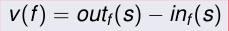{ width=250px }

el valor de un flujo es la cantidad neta de bienes producidos.

### Flujos maximales
<!-- from 03_flujos2021_v2_HIGHEXT.md -->

#### Definición
<!-- from 03_flujos2021_v2_HIGHEXT.md -->
\
Dado un network N y vertices s, t,
**un flujo maximal de s a t**
(o “Max flow”)
es un flujo f de s a t tal que v(g)  $\leq$  v(f) para todo flujo g de s a t.

#### Propiedad
<!-- from 03_flujos2021_v2_HIGHEXT.md -->
\

# Flujos: Greedy.
<!-- from 04_Flujos2Greedy_2023_v2_HIGHEXT.md -->

## notación g(A, B)
<!-- from 04_Flujos2Greedy_2023_v2_HIGHEXT.md -->

g es una función sobre los lados y A, B  $\subseteq$  V

\
{ width=250px }

### Propiedad:
<!-- from 04_Flujos2Greedy_2023_v2_HIGHEXT.md -->

Sean f, g funciones sobre los lados tales que

\
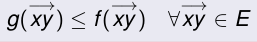{ width=250px }

Entonces

g(A, B)  $\leq$  f(A, B)  $\forall$ A, B  $\subseteq$  V

## Criterio simple para maximalidad
<!-- from 04_Flujos2Greedy_2023_v2_HIGHEXT.md -->

### Propiedad:
<!-- from 04_Flujos2Greedy_2023_v2_HIGHEXT.md -->

Sea f flujo en un network N tal que v(f) = c({s}, V). Entonces f es maximal.

## Existencia
<!-- from 04_Flujos2Greedy_2023_v2_HIGHEXT.md -->

de la definición no es claro que EXISTA un flujo maximal.

### flujo sea “entero”,
<!-- from 04_Flujos2Greedy_2023_v2_HIGHEXT.md -->
es decir que las capacidades y el flujo en cada lado deben ser números enteros,

### entonces,
<!-- from 04_Flujos2Greedy_2023_v2_HIGHEXT.md -->
como hay una cantidad finita de flujos enteros, es claro que existe un flujo entero maximal.

## Greedy
<!-- from 04_Flujos2Greedy_2023_v2_HIGHEXT.md -->

### Algoritmo
<!-- from 04_Flujos2Greedy_2023_v2_HIGHEXT.md -->

\
{ width=250px }

Comenzar con f = 0 (es decir,

Buscar un camino dirigido s = x0, x1, ..., xr = t, con

\
{ width=250px }

tal que

\
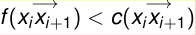{ width=250px }

para todo
$\in$  i = 0, ..., r  $-$  1.

(llamaremos a un tal camino un camino dirigido “no saturado” .)

Calcular

\
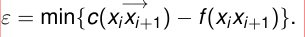{ width=250px }

Aumentar f a lo largo del camino de 2. en  $\epsilon$ , como se explicó antes.

Repetir 2 hasta que no se puedan hallar mas caminos con esas condiciones.

### Conclusiones sobre Greedy
<!-- from 04_Flujos2Greedy_2023_v2_HIGHEXT.md -->

este Greedy no necesariamente va a encontrar un flujo maximal.

eligiendo inteligentemente los caminos encontramos un flujo maximal.

el Greedy de caminos puede ser modificado para encontrar un flujo maximal en tiempo polinomial

### Not Greedy
<!-- from 04_Flujos2Greedy_2023_v2_HIGHEXT.md -->

En el caso de flujos, se puede construir un algoritmo que corre Greedy y cuando llega a un cierto punto, “SE DA CUENTA” que se equivocó en la elección de los caminos

y CORREGIR los errores.

### Definición de Corte
<!-- from 04_Flujos2Greedy_2023_v2_HIGHEXT.md -->

Un Corte es un subconjunto de los vertices que tiene a s pero no tiene a t.

### Capacidad de un Corte
<!-- from 04_Flujos2Greedy_2023_v2_HIGHEXT.md -->

La capacidad de un corte es cap(S) = c(S, S), donde S = V  $-$  S

### Definición:
<!-- from 04_Flujos2Greedy_2023_v2_HIGHEXT.md -->
# Ford-Fulkerson
<!-- from 05_FF2023_2_2023_v2_HIGHEXT.md -->

### Complejidad de Greedy
<!-- from 05_FF2023_2_2023_v2_HIGHEXT.md -->

Como en Greedy los lados nunca se des-saturan, entonces Greedy puede hacer a lo sumo O(m) incrementos de flujo antes de que forzosamente deba terminar si o si.

Encontrar un camino dirigido no saturado es O(m)

la complejidad total de Greedy es O(m2).

## FF
<!-- from 05_FF2023_2_2023_v2_HIGHEXT.md -->

### idea
<!-- from 05_FF2023_2_2023_v2_HIGHEXT.md -->

\
{ width=250px }

en vez de limitar la busqueda a

\
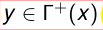{ width=250px }

con

permiten ademas buscar

\
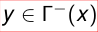{ width=250px }

con

\
{ width=250px }

### Camino aumentante
<!-- from 05_FF2023_2_2023_v2_HIGHEXT.md -->

Un camino aumentante (o f-camino aumentante si necesitamos especificar f) o camino de Ford-Fulkerson, es una sucesión de vértices x0, x1, ...., xr tales que:

x0 = s, xr = t.
Para cada i = 0, ..., r  $-$  1 ocurre una de las dos cosas siguientes:

\
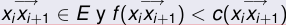{ width=250px }

1

\
{ width=250px }

2

Si en vez de comenzar en s y terminar t el camino es como arriba pero con x0 = x,xr = z diremos que es un camino aumentante
**desde x a z**

#### Lados forward y backward
<!-- from 05_FF2023_2_2023_v2_HIGHEXT.md -->
\

A los lados en 1) los llamaremos “lados de tipo I” o
**“lados forward”**

A los lados en 2) los llamaremos “lados de tipo II” o
**“lados backward”**

### Algoritmo de Ford-Fulkerson
<!-- from 05_FF2023_2_2023_v2_HIGHEXT.md -->

\
{ width=250px }

Comenzar con f = 0 (es decir,

Buscar un f-camino aumentante s = x0, x1, ..., xr = t.

Definir  $\epsilon$ i de la siguiente manera:

\
{ width=250px }

en los lados forward.

\
{ width=250px }

en los lados backward.

Calcular  $\epsilon$  = min{ $\epsilon$ i}.

Cambiar f a lo largo del camino de [2] en  $\epsilon$ , de la siguiente forma:

\
{ width=250px }

en los lados forward.

\
{ width=250px }

en los lados backwards.

Repetir [2] hasta que no se puedan hallar mas caminos aumentantes.

### FordFulkerson mantiene “flujicidad”
<!-- from 05_FF2023_2_2023_v2_HIGHEXT.md -->

Si f es un flujo de valor v y aumentamos f con un f-camino aumentante con  $\epsilon$  calculado como se explica en el algoritmo de Ford-Fulkerson, entonces lo que queda sigue siendo flujo y el valor del nuevo flujo es v +  $\epsilon$

### Complejidad de Ford-Fulkerson
<!-- from 05_FF2023_2_2023_v2_HIGHEXT.md -->

NO ES polinomial:

## Max Flow Min Cut
<!-- from 05_FF2023_2_2023_v2_HIGHEXT.md -->

### Teorema
<!-- from 05_FF2023_2_2023_v2_HIGHEXT.md -->

\
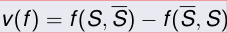{ width=250px }

#### A
<!-- from 05_FF2023_2_2023_v2_HIGHEXT.md -->
\
Si f es un flujo y S es un corte, entonces

#### B
<!-- from 05_FF2023_2_2023_v2_HIGHEXT.md -->
\
El valor de todo flujo es menor o igual que la capacidad de todo corte.

#### C
<!-- from 05_FF2023_2_2023_v2_HIGHEXT.md -->
\
Si f es un flujo, las siguientes afirmaciones son equivalentes:

1 Existe un corte S tal que v(f) = cap(S).
2 f es maximal.
3 No existen f-caminos aumentantes.

### Corolario
<!-- from 05_FF2023_2_2023_v2_HIGHEXT.md -->

Si el algoritmo de Ford-Fulkerson termina, termina con un flujo maximal

## Teorema de la Integralidad
<!-- from 05_FF2023_2_2023_v2_HIGHEXT.md -->

### Teorema de la integralidad.
<!-- from 05_FF2023_2_2023_v2_HIGHEXT.md -->

En un network con capacidades enteras, todo flujo entero maximal es un flujo maximal.

### Teorema
<!-- from 05_FF2023_2_2023_v2_HIGHEXT.md -->
## Ford-Fulkerson con DFS
<!-- from 08_EK2021_v2_HIGHEXT.md -->

1 Creamos una pila con s.

2 Si la pila es vacia, terminamos, no hay camino. Si no es vacia,
tomamos x =el primer elemento de la pila y buscamos algún vécino de x que satisfaga las condiciones de Ford-Fulkerson.

3 Si no hay, sacamos a x de la pila y repetimos 2).
4 Si hay tal vécino, tomamos z uno de ellos.
5 Si z = t encontramos nuestro camino.

6 Si no, agregamos z a la pila y repetimos 2).

### ventaja
<!-- from 08_EK2021_v2_HIGHEXT.md -->
DFS es O(m) asi que la búsqueda de caminos es polinomial.

### desventaja
<!-- from 08_EK2021_v2_HIGHEXT.md -->
con DFS Ford-Fulkerson puede no terminar nunca,

# Edmonds y Karp
<!-- from 08_EK2021_v2_HIGHEXT.md -->

### propusieron estas dos alternativas.
<!-- from 08_EK2021_v2_HIGHEXT.md -->

aumentar eligiendo caminos de longitud mínima, y aumentar eligiendo caminos de aumento máximo.

### Algunos libros lo llaman “heurística”
<!-- from 08_EK2021_v2_HIGHEXT.md -->
porque no es un nuevo algoritmo, sino que
es Ford-Fulkerson con la especificación de usar BFS para la búsqueda.

#### buena forma de recordarlo
<!-- from 08_EK2021_v2_HIGHEXT.md -->
\
es que EK=FF+BFS.

### Otra cosa que tienen que hacer
<!-- from 08_EK2021_v2_HIGHEXT.md -->
## Complejidad de Edmonds-Karp
<!-- from 09_EK2021complejidad_v2_HIGHEXT.md -->

### Teorema de Edmonds-Karp
<!-- from 09_EK2021complejidad_v2_HIGHEXT.md -->

La complejidad del algoritmo de Edmonds-Karp es O(nm2)

### Lados críticos
<!-- from 09_EK2021complejidad_v2_HIGHEXT.md -->

#### Definición
<!-- from 09_EK2021complejidad_v2_HIGHEXT.md -->
\

\
{ width=250px }

Diremos que un llado
**se vuelve crítico**
durante la construcción de uno de los flujos intermedios (digamos, fk+1) si para la construcción de

\
{ width=250px }

pasa una de las dos cosas siguientes:

1 Se usa el lado en forma forward, saturandolo (es decir

\
{ width=250px }
\
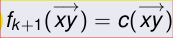{ width=250px }

pero luego

2 O se usa el lado en forma backward, vaciandolo (es decir

\
{ width=250px }
\
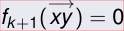{ width=250px }

pero

### distancias
<!-- from 09_EK2021complejidad_v2_HIGHEXT.md -->

#### Definición
<!-- from 09_EK2021complejidad_v2_HIGHEXT.md -->
\
Dados vértices x, z y flujo f definimos a
**la distancia entre x y z relativa a f**
como la longitud del menor f-camino aumentante entre x y z, si es que existe tal camino, o infinito si no existe o 0 si x = z.
**La denotaremos como df(x, z).**

#### Notación
<!-- from 09_EK2021complejidad_v2_HIGHEXT.md -->
\
Dado un vértice x denotamos

\
{ width=250px }

y

\
{ width=250px }

#### Es decir,
<!-- from 09_EK2021complejidad_v2_HIGHEXT.md -->
\
dk(x) es la longitud del menor fk-camino aumentante entre s y x y bk(x) es la longitud del menor fk-camino aumentante entre x y t.

### Definición
<!-- from 09_EK2021complejidad_v2_HIGHEXT.md -->
Dado un flujo f y un vértice x, diremos que un vértice z es un vécino fFF de x si pasa alguna de las siguientes condiciones:

\
{ width=250px }
\
{ width=250px }

### Observación trivial:
<!-- from 09_EK2021complejidad_v2_HIGHEXT.md -->
Si z es un fkFF vécino de x, entonces dk(z)  $\leq$  dk(x) + 1

### Lema de las distancias
<!-- from 09_EK2021complejidad_v2_HIGHEXT.md -->
Las distancias definidas anteriormente no disminuyen a medida que k crece.

\
{ width=250px }

Es decir,

## Existencia de flujos maximales
<!-- from 09_EK2021complejidad_v2_HIGHEXT.md -->

Dado que hemos probado que Edmonds-Karp siempre termina, y dado que produce un flujo maximal,

entonces tambien hemos probado que
# El algoritmo de Dinitz
<!-- from 10_Dinic2021S_v2_HIGHEXT.md -->

## idea básica de Dinitz
<!-- from 10_Dinic2021S_v2_HIGHEXT.md -->
“guardar” todos los posibles caminos aumentantes de la misma longitud (mínima) en una estructura auxiliar.

esta primera parte se hace, al igual que con Edmonds-Karp, con BFS, pero guardamos toda la información y no sólo la necesaria para construir un camino.

## Esquema básico de Dinitz
<!-- from 10_Dinic2021S_v2_HIGHEXT.md -->

1 Construir un network auxiliar (usando BFS).
2 Correr Greedy con DFS en el network auxiliar hasta no poder seguir.

3 Usar el flujo obtenido en el network auxiliar para modificar el flujo en el network original.

4 Repetir [1] con el nuevo flujo, hasta que, al querer construir un network auxiliar, no llegamos a t.

En el network auxiliar, como se usa Greedy, nunca se des-satura un lado.
los lados siguen pudiendo des-saturarse, es sólo en el network auxiliar que no se des-saturan.

### Flujos bloqueantes
<!-- from 10_Dinic2021S_v2_HIGHEXT.md -->

#### Definición:
<!-- from 10_Dinic2021S_v2_HIGHEXT.md -->
\
Llamaremos a un flujo en un network
si todo camino DIRIGIDO desde s a t tiene al menos un lado

\
{ width=250px }

saturado. (es decir con

En otras palabras, si cuando queremos usar Greedy en el network, no llegamos a t.

## Algoritmos tipo Dinic
<!-- from 10_Dinic2021S_v2_HIGHEXT.md -->

1 Construir un network auxiliar (usando BFS).

2 Encontrar un flujo bloqueante en el network auxiliar.
3 Usar ese flujo bloqueante del network auxiliar para modificar el flujo en el network original.

4 Repetir [1] con el nuevo flujo, hasta que, al querer construir un network auxiliar, no llegamos a t.

## Layered Networks
<!-- from 10_Dinic2021S_v2_HIGHEXT.md -->

### network “por niveles”.
<!-- from 10_Dinic2021S_v2_HIGHEXT.md -->

#### Definición:
<!-- from 10_Dinic2021S_v2_HIGHEXT.md -->
\
Un Network por niveles es un network tal que el conjunto de vértices esta dividido en subconjuntos Vi (los “niveles”) tales que sólo existen lados entre un nivel y el siguiente.

\
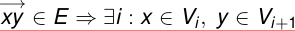{ width=250px }

Es decir,

## Network auxiliar,
<!-- from 10_Dinic2021S_v2_HIGHEXT.md -->

### vértices
<!-- from 10_Dinic2021S_v2_HIGHEXT.md -->

\
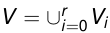{ width=250px }

el conjunto de vértices es
donde los Vi son:

Sea r = df(s, t) donde df es la función definida en la prueba de Edmonds-Karp.

Es decir, r es la distancia entre s y t usando caminos aumentantes.

Para i = 0, 1, ..., r  $-$  1, definimos Vi = {x : df(s, x) = i}.

Observar que entonces V0 = {s}.

Definimos Vr = {t}

\
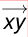{ width=250px }

### Lados y capacidades:
<!-- from 10_Dinic2021S_v2_HIGHEXT.md -->
es un lado del network auxiliar si:

x  $\in$  Vi, y  $\in$  Vi+1
y:

\
{ width=250px }
\
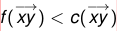{ width=250px }

es un lado del network original con

1

o:

\
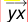{ width=250px }
\
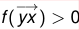{ width=250px }

es un lado del network original con

2

\
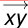{ width=250px }

En el caso de [1], la capacidad de
en el network

\
{ width=250px }

auxiliar será
y en el caso de [2], la

\
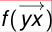{ width=250px }
\
{ width=250px }

capacidad del lado
en el network auxiliar será

### Otra forma de pensar esto
<!-- from 10_Dinic2021S_v2_HIGHEXT.md -->
es que construimos primero un “network residual”

#### Cuyos lados son:
<!-- from 10_Dinic2021S_v2_HIGHEXT.md -->
\

los lados originales, con capacidad igual a c  $-$  f
$-$  Y los reversos de los lados originales, con capacidad f.

Y luego, de ese network residual nos quedamos con los lados que unan vertices de distancia i con vértices de distancia i + 1.

### Construcción
<!-- from 10_Dinic2021S_v2_HIGHEXT.md -->

la forma de construirla es tomar como V0 a {s}.

Y luego ir construyendo una cola a partir de s al estilo Edmonds-Karp.

Y si x agrega a z y x está en Vi, entonces z está en Vi+1.

si z ya está agregado, si bien z no se

\
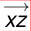{ width=250px }

vuelve a agregar, el lado
si se agrega al network auxilir, siempre y cuando la distancia de z a s sea uno mas que la distancia de x a s.

Si en algún momento llegamos a t, no paramos inmediatamente, pues podria haber mas lados que lleguen a t.

Pero borramos todos los vértices que ya hubieramos incluido en el mismo Vr en el cual estamos poniendo a t

Y de ahi en mas no agregamos mas vértices, sólo lados entre vértices de

\
{ width=250px }

y t.

### Observaciones
<!-- from 10_Dinic2021S_v2_HIGHEXT.md -->

Como el network auxiliar es un network por niveles,
**todos**
los caminos de un mismo network auxiliar deben tener
**la misma longitud.**

## Complejidad “naive”de Dinitz
<!-- from 10_DinitzvsDinicEven_v2_HIGHEXT.md -->

depende de cuantos networks auxiliares tengamos que construir.

La construcción de cada uno es O(m).

complejidad total de hallar un flujo bloqueante
en un network auxiliar igual a O(m2).

la complejidad total de Dinica seria n.(O(m) + O(m2)) = O(nm2),

## idea de la implementación de Ever:
<!-- from 10_DinitzvsDinicEven_v2_HIGHEXT.md -->

cuando corremos DFS, si llegamos a un vértice x que no tiene vecinos, debemos hacer un backtrack, borrando a x de la pila y usando el vértice anterior a x en el camino para seguir buscando.
Esa información de que es inútil seguir buscando por x
**no deberiamos perderla**
y hay que “guardarla” para futuras corridas de DFS.
La forma que tiene Ever de “guardar”esa información es simplemente borrar x, o bien, si hacemos backtrack desde x a z,

\
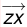{ width=250px }

borrar el lado

## Diferencia entre la version rusa y la occidental de Dinitz
<!-- from 10_DinitzvsDinicEven_v2_HIGHEXT.md -->

La diferencia entre Dinitz y Dinic-Even es en cómo y cuando se actualiza el network a medida que encontramos nuevos caminos.

### Ever
<!-- from 10_DinitzvsDinicEven_v2_HIGHEXT.md -->
borra varios lados (o vértices) extras mientras corre DFS, cada vez que tiene que hacer un backtrack.

### Dinitz,
<!-- from 10_DinitzvsDinicEven_v2_HIGHEXT.md -->
el network auxiliar se construye de forma tal que
**DFS nunca tenga que hacer backtrack.**

Y cada vez que se encuentra un camino entre s y t y se cambia el flujo, tambien se cambia el network auxiliar para seguir teniendo esta propiedad.

### Es decir,
<!-- from 10_DinitzvsDinicEven_v2_HIGHEXT.md -->
en el original se usa un poco mas de tiempo actualizando el network auxiliar luego de cada camino,

mientras que en la versión de Even, no se pierde tanto tiempo actualizando el network auxiliar
**entre**
caminos, pero las busquedas DFS no demoran todas igual

Ever es mas “lazy” y sólo borra lados si los encuentra y se da cuenta que no los necesita, mientras que la versión original de Dinitz es mas proactiva y borra todos los lados que sabe que son inútiles aún si luego nunca los

